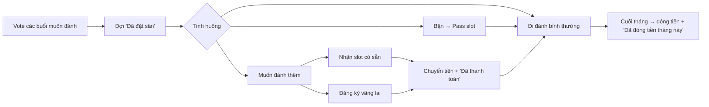
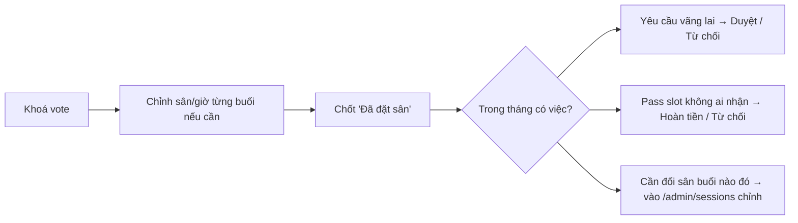

# User Flows — Uma Badminton

2 user journey, mermaid, chỉ những gì người dùng cần làm.

## 1. Member

## 2. Admin

Lưu ý:
- **Member** không cần biết thuật ngữ trạng thái — UI tự dẫn (banner "Đang mở vote", "Cần thanh toán", v.v.).
- **Admin** thao tác chính qua `/lich` (toàn tháng) + `/admin/sessions/<id>` (per buổi).
- Tiền chuyển khoản handle ngoài hệ thống; app chỉ ghi nhận "đã chuyển" / "đã đóng".
